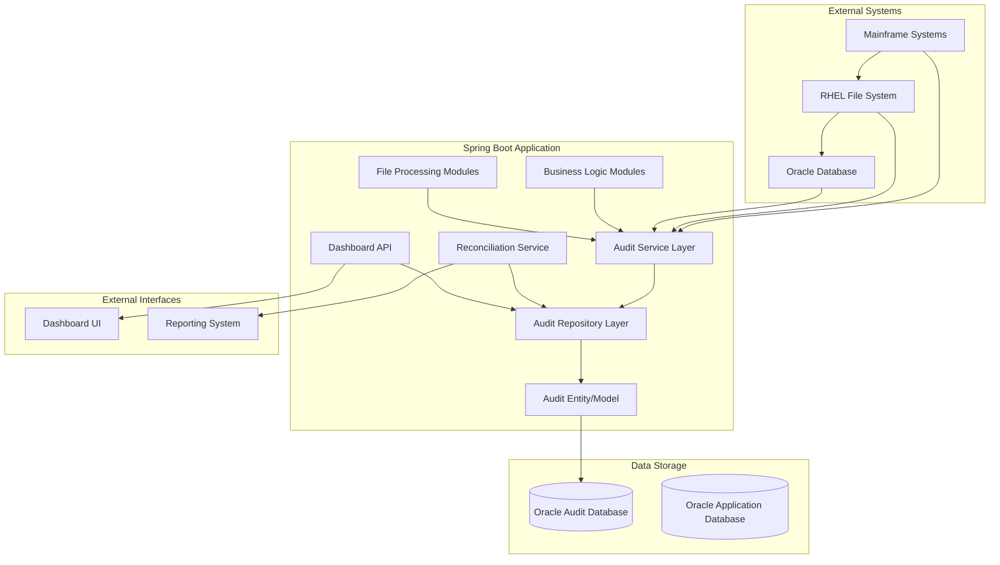

# Design Document

## Overview

The Batch Audit System is designed as a comprehensive, centralized audit trail solution for a Spring Boot application that processes data from multiple source systems. The system uses Oracle database with JdbcTemplate as the primary data store and exposes functionality through REST APIs. The system implements a checkpoint-based architecture that captures audit events at critical pipeline transition points, ensuring complete traceability from source files through Oracle staging tables, Java module transformations, and final output file generation.

The design follows Spring Boot best practices with a layered architecture, utilizing Spring JdbcTemplate with Oracle database for direct SQL operations and optimal performance, Spring Web MVC for REST API endpoints, Spring Boot Actuator for monitoring, and a service-oriented approach for audit event management.

## Architecture

### High-Level Architecture



### Layered Architecture

1. **Presentation Layer**: Spring Boot REST APIs for dashboard and reporting functionality
2. **Service Layer**: Core audit business logic and orchestration services
3. **Repository Layer**: Data access using Spring JdbcTemplate with Oracle database for direct SQL operations
4. **Model Layer**: POJOs representing audit data model optimized for Oracle
5. **Infrastructure Layer**: Oracle database configuration and external system integrations

## Components and Interfaces

### Core Components

#### 1. AuditService
**Purpose**: Central service for managing all audit operations

**Key Methods**:
```java
public interface AuditService {
    void logCheckpoint(AuditEvent event);
    void logFileTransfer(String sourceSystem, String fileName, FileMetadata metadata);
    void logSqlLoaderOperation(String sourceSystem, String tableName, LoadStatistics stats);
    void logBusinessRuleApplication(String sourceSystem, String moduleName, String keyId, RuleApplication rule);
    void logFileGeneration(String sourceSystem, String moduleName, String fileName, OutputMetadata metadata);
    List<AuditEvent> getAuditTrail(String correlationId);
    ReconciliationReport generateReconciliationReport(String correlationId);
}
```

#### 2. AuditRepository
**Purpose**: Data access layer for audit events using JdbcTemplate

**Key Methods**:
```java
@Repository
public class AuditRepository {
    private final JdbcTemplate jdbcTemplate;
    private final RowMapper<AuditEvent> auditEventRowMapper;
    
    public void save(AuditEvent auditEvent);
    public Optional<AuditEvent> findById(UUID auditId);
    public List<AuditEvent> findByCorrelationIdOrderByEventTimestamp(UUID correlationId);
    public List<AuditEvent> findBySourceSystemAndCheckpointStage(String sourceSystem, String checkpointStage);
    public List<AuditEvent> findByModuleNameAndStatus(String moduleName, AuditStatus status);
    public List<AuditEvent> findByEventTimestampBetween(LocalDateTime start, LocalDateTime end);
    public long countByCorrelationIdAndStatus(UUID correlationId, AuditStatus status);
    public List<AuditEvent> findAllWithPagination(int offset, int limit);
}
```

#### 3. CorrelationIdManager
**Purpose**: Manages correlation IDs for pipeline runs

**Key Methods**:
```java
public interface CorrelationIdManager {
    UUID generateCorrelationId();
    UUID getCurrentCorrelationId();
    void setCorrelationId(UUID correlationId);
    void clearCorrelationId();
}
```

#### 4. ReconciliationService
**Purpose**: Generates reconciliation reports and performs data integrity checks

**Key Methods**:
```java
public interface ReconciliationService {
    ReconciliationReport generateReport(UUID correlationId);
    List<DataDiscrepancy> identifyDiscrepancies(UUID correlationId);
    Map<String, Long> getRecordCountsBySourceSystem(UUID correlationId);
    boolean validateDataIntegrity(UUID correlationId);
}
```

#### 5. AuditDashboardController
**Purpose**: REST API for dashboard and reporting functionality with Swagger documentation

**Key Endpoints**:
```java
@RestController
@RequestMapping("/api/audit")
@Tag(name = "Audit Dashboard", description = "Audit trail monitoring and reporting APIs")
public class AuditDashboardController {
    
    @GetMapping("/events")
    @Operation(summary = "Get audit events", description = "Retrieve audit events with filtering and pagination")
    @ApiResponses({
        @ApiResponse(responseCode = "200", description = "Successfully retrieved audit events"),
        @ApiResponse(responseCode = "400", description = "Invalid filter parameters")
    })
    ResponseEntity<Page<AuditEvent>> getAuditEvents(
        @Parameter(description = "Source system filter") @RequestParam(required = false) String sourceSystem,
        @Parameter(description = "Module name filter") @RequestParam(required = false) String moduleName,
        @Parameter(description = "Audit status filter") @RequestParam(required = false) AuditStatus status,
        @Parameter(description = "Pagination parameters") Pageable pageable
    );
    
    @GetMapping("/reconciliation/{correlationId}")
    @Operation(summary = "Get reconciliation report", description = "Retrieve reconciliation report for specific correlation ID")
    ResponseEntity<ReconciliationReport> getReconciliationReport(
        @Parameter(description = "Correlation ID") @PathVariable UUID correlationId
    );
    
    @GetMapping("/statistics")
    @Operation(summary = "Get audit statistics", description = "Retrieve audit statistics for specified date range")
    ResponseEntity<AuditStatistics> getAuditStatistics(
        @Parameter(description = "Start date") @RequestParam LocalDateTime startDate,
        @Parameter(description = "End date") @RequestParam LocalDateTime endDate
    );
    
    @GetMapping("/discrepancies")
    @Operation(summary = "Get data discrepancies", description = "Retrieve data discrepancies with filtering")
    ResponseEntity<List<DataDiscrepancy>> getDiscrepancies(@RequestParam Map<String, String> filters);
}
```

#### 6. Swagger Configuration
**Purpose**: API documentation and interactive testing interface

```java
@Configuration
@OpenAPIDefinition(
    info = @Info(
        title = "Batch Audit System API",
        version = "1.0.0",
        description = "Comprehensive audit trail system for data pipeline monitoring",
        contact = @Contact(name = "Audit Team", email = "audit-team@company.com")
    ),
    servers = {
        @Server(url = "http://localhost:8080", description = "Development server"),
        @Server(url = "https://audit-api.company.com", description = "Production server")
    }
)
public class SwaggerConfig {
    
    @Bean
    public GroupedOpenApi auditApi() {
        return GroupedOpenApi.builder()
            .group("audit-system")
            .pathsToMatch("/api/audit/**")
            .build();
    }
}
```

### Integration Points

#### 1. Aspect-Oriented Programming (AOP)
Use Spring AOP to automatically capture audit events in business logic modules:

```java
@Aspect
@Component
public class AuditAspect {
    @Around("@annotation(Auditable)")
    public Object auditBusinessLogic(ProceedingJoinPoint joinPoint, Auditable auditable) {
        // Capture method execution and log audit event
    }
}
```

#### 2. Event-Driven Architecture
Implement Spring Application Events for decoupled audit logging:

```java
@EventListener
public void handleFileTransferEvent(FileTransferEvent event) {
    auditService.logFileTransfer(event.getSourceSystem(), event.getFileName(), event.getMetadata());
}
```

## Data Models

### Primary Entity: AuditEvent

```java
public class AuditEvent {
    private UUID auditId;
    private UUID correlationId;
    private String sourceSystem;
    private String moduleName;
    private String processName;
    private String sourceEntity;
    private String destinationEntity;
    private String keyIdentifier;
    private String checkpointStage;
    private LocalDateTime eventTimestamp;
    private AuditStatus status;
    private String message;
    private String detailsJson;
    
    // Constructors, getters, setters, builder pattern
    
    public static class Builder {
        private UUID auditId;
        private UUID correlationId;
        private String sourceSystem;
        // ... other fields
        
        public Builder auditId(UUID auditId) {
            this.auditId = auditId;
            return this;
        }
        
        public AuditEvent build() {
            return new AuditEvent(this);
        }
    }
}

// RowMapper for JdbcTemplate result set mapping
public class AuditEventRowMapper implements RowMapper<AuditEvent> {
    @Override
    public AuditEvent mapRow(ResultSet rs, int rowNum) throws SQLException {
        return AuditEvent.builder()
            .auditId(UUID.fromString(rs.getString("AUDIT_ID")))
            .correlationId(UUID.fromString(rs.getString("CORRELATION_ID")))
            .sourceSystem(rs.getString("SOURCE_SYSTEM"))
            .moduleName(rs.getString("MODULE_NAME"))
            .processName(rs.getString("PROCESS_NAME"))
            .sourceEntity(rs.getString("SOURCE_ENTITY"))
            .destinationEntity(rs.getString("DESTINATION_ENTITY"))
            .keyIdentifier(rs.getString("KEY_IDENTIFIER"))
            .checkpointStage(rs.getString("CHECKPOINT_STAGE"))
            .eventTimestamp(rs.getTimestamp("EVENT_TIMESTAMP").toLocalDateTime())
            .status(AuditStatus.valueOf(rs.getString("STATUS")))
            .message(rs.getString("MESSAGE"))
            .detailsJson(rs.getString("DETAILS_JSON"))
            .build();
    }
}
```

### Supporting Models

```java
public enum AuditStatus {
    SUCCESS, FAILURE, WARNING
}

public enum CheckpointStage {
    RHEL_LANDING("RHEL_LANDING"),
    SQLLOADER_START("SQLLOADER_START"),
    SQLLOADER_COMPLETE("SQLLOADER_COMPLETE"),
    LOGIC_APPLIED("LOGIC_APPLIED"),
    FILE_GENERATED("FILE_GENERATED");
}

@JsonInclude(JsonInclude.Include.NON_NULL)
public class AuditDetails {
    private Long fileSizeBytes;
    private String fileHashSha256;
    private Long rowsRead;
    private Long rowsLoaded;
    private Long rowsRejected;
    private Long recordCount;
    private BigDecimal controlTotalDebits;
    private Map<String, Object> ruleInput;
    private Map<String, Object> ruleOutput;
    // getters, setters
}
```

## Error Handling

### Exception Hierarchy

```java
public class AuditException extends RuntimeException {
    public AuditException(String message, Throwable cause) {
        super(message, cause);
    }
}

public class AuditPersistenceException extends AuditException {
    // Database-related audit failures
}

public class CorrelationIdException extends AuditException {
    // Correlation ID management failures
}
```

### Error Handling Strategy

1. **Graceful Degradation**: Audit failures should not break the main pipeline
2. **Retry Mechanism**: Implement exponential backoff for transient failures
3. **Dead Letter Queue**: Store failed audit events for later processing
4. **Circuit Breaker**: Prevent cascade failures when audit system is down

```java
@Retryable(value = {AuditPersistenceException.class}, maxAttempts = 3, backoff = @Backoff(delay = 1000))
public void logAuditEvent(AuditEvent event) {
    try {
        auditRepository.save(event);
    } catch (Exception e) {
        // Log to dead letter queue
        deadLetterService.store(event);
        throw new AuditPersistenceException("Failed to persist audit event", e);
    }
}
```

## Testing Strategy

### Unit Testing
- **Service Layer**: Mock repository dependencies, test business logic
- **Repository Layer**: Use @JdbcTest for database integration tests with JdbcTemplate
- **Controller Layer**: Use @WebMvcTest for API endpoint testing

### Integration Testing
- **End-to-End Audit Flow**: Test complete audit trail from file transfer to reconciliation
- **Database Integration**: Verify audit event persistence and querying
- **External System Integration**: Mock mainframe and Oracle interactions

### Performance Testing
- **Load Testing**: Simulate high-volume audit event generation
- **Database Performance**: Test query performance with large audit datasets
- **Memory Usage**: Monitor memory consumption during bulk audit operations

### Test Data Management
```java
@TestConfiguration
public class AuditTestConfig {
    @Bean
    @Primary
    public AuditService mockAuditService() {
        return Mockito.mock(AuditService.class);
    }
    
    @Bean
    public AuditEventTestDataBuilder auditEventTestDataBuilder() {
        return new AuditEventTestDataBuilder();
    }
    
    @Bean
    public TestJdbcTemplate testJdbcTemplate(DataSource dataSource) {
        return new TestJdbcTemplate(dataSource);
    }
}
```

## Configuration and Deployment

### Application Properties
```yaml
audit:
  database:
    batch-size: 100
    connection-pool-size: 10
  retention:
    days: 365
  reconciliation:
    auto-generate: true
    schedule: "0 0 6 * * ?"
  dashboard:
    page-size: 50
    max-export-records: 10000

spring:
  datasource:
    audit:
      url: jdbc:oracle:thin:@//localhost:1521/AUDIT
      username: ${AUDIT_DB_USER}
      password: ${AUDIT_DB_PASSWORD}
      driver-class-name: oracle.jdbc.OracleDriver
  jpa:
    properties:
      hibernate:
        dialect: org.hibernate.dialect.Oracle19cDialect
        jdbc:
          batch_size: ${audit.database.batch-size}
  liquibase:
    change-log: classpath:db/changelog/db.changelog-master.xml
    contexts: ${spring.profiles.active}
    drop-first: false
    enabled: true
```

### Security Configuration
```java
@Configuration
@EnableWebSecurity
public class AuditSecurityConfig {
    @Bean
    public SecurityFilterChain auditApiSecurity(HttpSecurity http) throws Exception {
        return http
            .requestMatchers("/api/audit/**")
            .hasRole("AUDIT_VIEWER")
            .and()
            .oauth2ResourceServer()
            .jwt()
            .and()
            .build();
    }
}
```