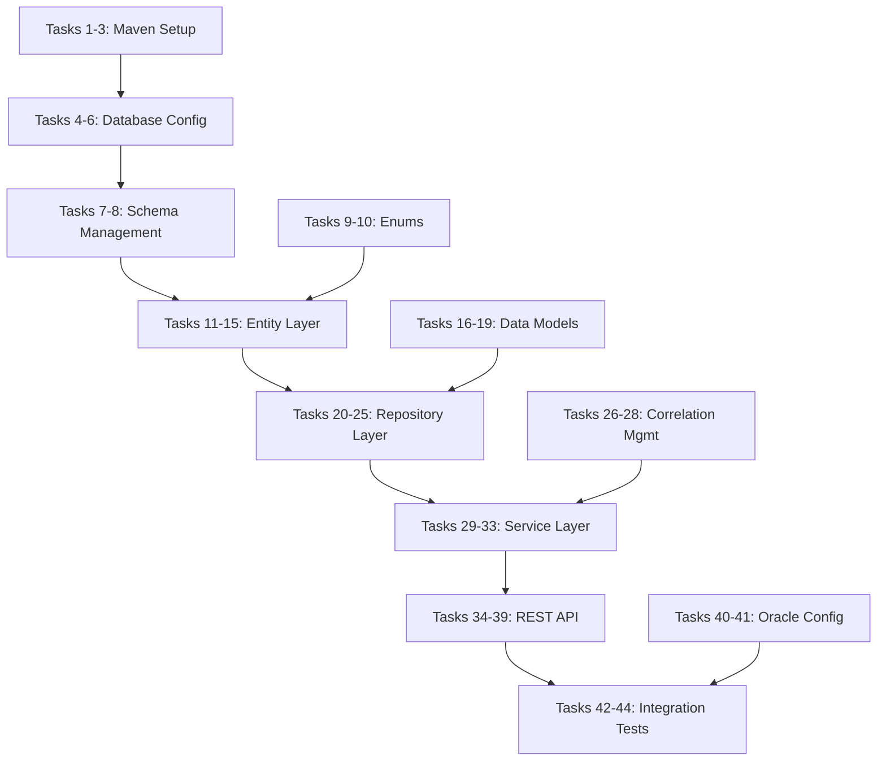

# Task Reference Guide

This document provides a quick reference for the 44-task implementation plan, organized by development phases and functional areas.

## Current Implementation Status

**Overall Progress**: 1/45 tasks completed (2.2%)
**Current Phase**: Phase 1 - Foundation Setup
**Last Completed**: Task 1 - Basic Maven project structure
**Next Priority**: Task 2 - Add Oracle database dependencies

### Immediate Next Steps (Tasks 2-5)

1. **Task 2**: Add Oracle JDBC driver, HikariCP, and Liquibase dependencies to `pom.xml`
2. **Task 3**: Create `BatchAuditApplication.java` main class with `@SpringBootApplication`
3. **Task 4**: Configure Oracle database connection properties in `application.yml`
4. **Task 5**: Set up Oracle local development properties file

### Current Project State
- ✅ Maven project structure established
- ✅ Spring Boot 2.7.18 parent configuration
- ✅ Core Spring Boot starters (web, jdbc, test)
- ✅ SpringDoc OpenAPI dependency for Swagger UI
- ✅ Basic `application-local.properties` file exists
- ❌ No Java source files created yet
- ❌ Oracle dependencies not added
- ❌ Database schema not created

## Task Overview by Phase

### Phase 1: Foundation (Tasks 1-15) - *1/15 Complete*
**Duration**: 2-3 weeks  
**Focus**: Project setup, database configuration, and core entities

| Task | Component | Description | Status | Requirements |
|------|-----------|-------------|--------|--------------|
| 1 | Maven Setup | Project structure, Spring Boot dependencies | ✅ Complete | 2.1, 6.7 |
| 2-3 | Maven Setup | Oracle drivers, Spring Boot application class | ⏳ Pending | 2.1, 2.2 |
| 4-6 | Database Config | Oracle connection, Liquibase setup, local development | ⏳ Pending | 2.2, 2.5 |
| 7-8 | Schema Management | Audit table creation, performance indexes | ⏳ Pending | 2.2, 6.1, 6.2 |
| 9-10 | Core Enums | AuditStatus and CheckpointStage definitions | ⏳ Pending | 2.2, 7.1-7.5 |
| 11-15 | Entity Layer | AuditEvent entity without JPA annotations and tests | ⏳ Pending | 2.2, 2.3, 8.2 |

### Phase 2: Data Layer (Tasks 16-25) - *0/10 Complete*
**Duration**: 2 weeks  
**Focus**: Data models, repository implementation, and database integration

| Task | Component | Description | Status | Requirements |
|------|-----------|-------------|--------|--------------|
| 16-19 | Data Models | AuditDetails POJO with JSON serialization | ⏳ Pending | 2.4, 3.1-3.4 |
| 20-23 | Repository Layer | JdbcTemplate repository with optimized query methods | ⏳ Pending | 1.2-1.4, 6.1-6.4 |
| 24-25 | Data Testing | Repository integration tests with Liquibase using @JdbcTest | ⏳ Pending | 2.1, 2.2, 6.1, 6.2 |

### Phase 3: Service Layer (Tasks 26-33) - *0/8 Complete*
**Duration**: 2-3 weeks  
**Focus**: Business logic, audit services, and correlation management

| Task | Component | Description | Status | Requirements |
|------|-----------|-------------|--------|--------------|
| 26-28 | Correlation Management | Thread-safe correlation ID management | ⏳ Pending | 1.2, 2.3 |
| 29-32 | Audit Service | Core audit operations with checkpoint methods | ⏳ Pending | 2.1, 7.1-7.4, 4.1-4.4 |
| 33 | Service Testing | Comprehensive unit tests with mocked dependencies | ⏳ Pending | 2.1, 2.2, 7.5 |

### Phase 4: API & Integration (Tasks 34-45) - *0/12 Complete*
**Duration**: 3-4 weeks  
**Focus**: REST APIs, security, and comprehensive testing

| Task | Component | Description | Status | Requirements |
|------|-----------|-------------|--------|--------------|
| 34 | Swagger Config | OpenAPI documentation configuration | ⏳ Pending | 6.7 |
| 35-39 | REST API | Dashboard controller with DTOs and integration tests | ⏳ Pending | 5.1-5.6, 6.1-6.6 |
| 40-42 | Oracle Integration | Oracle-specific configuration and database tests | ⏳ Pending | 2.2, 2.5 |
| 43-45 | Production Readiness | Error handling, security, end-to-end tests | ⏳ Pending | 7.5, 8.3-8.4, 1.1-1.2 |

## Task Dependencies

### Critical Path Dependencies

### Parallel Development Opportunities
- **Tasks 9-10** (Enums) can be developed in parallel with Tasks 4-8
- **Tasks 16-19** (Data Models) can be developed in parallel with Tasks 20-23
- **Tasks 26-28** (Correlation Management) can be developed in parallel with Tasks 29-32
- **Tasks 40-41** (Oracle Configuration) can be developed in parallel with Tasks 34-39

## Task Completion Checklist

### Per-Task Completion Criteria
- [ ] **Code Implementation**: All required classes and methods implemented following minimal implementation first principle
- [ ] **Spring Boot Standards**: Proper use of @Component, @Service, @Repository annotations and dependency injection
- [ ] **Unit Tests**: Minimum 80% code coverage for new components with mocked external dependencies
- [ ] **Integration Tests**: Database and API integration verified using test profiles
- [ ] **Documentation**: JavaDoc and inline comments added with meaningful descriptions
- [ ] **Code Review**: Peer review completed and approved following development guidelines
- [ ] **Naming Conventions**: Audit-related classes prefixed with "Audit", enum values in UPPER_CASE
- [ ] **Error Handling**: Proper exception handling with @ControllerAdvice where applicable

### Phase Completion Criteria

#### Phase 1 Completion
- [ ] Maven build executes successfully with all dependencies
- [ ] Oracle database connection established and tested
- [ ] Liquibase migrations create audit table and indexes
- [ ] AuditEvent entity persists and retrieves data correctly
- [ ] All enum values defined and tested

#### Phase 2 Completion
- [ ] AuditDetails model serializes to/from JSON correctly
- [ ] All repository query methods return expected results
- [ ] Database integration tests pass with Liquibase schema
- [ ] Performance benchmarks meet requirements for query response times

#### Phase 3 Completion
- [ ] Correlation ID management works across multiple threads
- [ ] All four checkpoint logging methods function correctly
- [ ] Service layer handles errors gracefully with proper exceptions
- [ ] Unit tests achieve required coverage with meaningful assertions

#### Phase 4 Completion
- [ ] REST API endpoints return correct JSON responses
- [ ] API security prevents unauthorized access to audit data
- [ ] End-to-end tests verify complete audit trail functionality
- [ ] Performance tests validate system under expected load

## Common Implementation Patterns

### Entity Development Pattern
1. Create basic POJO class without JPA annotations and Oracle-specific configurations
2. Add field validation and constraints with UUID primary keys
3. Implement constructors, getters, setters, equals, hashCode (minimal behavior)
4. Write unit tests for entity validation and serialization
5. Create repository class with @Repository annotation following Spring JdbcTemplate conventions
6. Add custom query methods with proper SQL and meaningful names
7. Write repository integration tests with test data using @JdbcTest

### Service Development Pattern
1. Define service interface with business method signatures using descriptive names
2. Create implementation class with @Service annotation and minimal implementation first
3. Inject repository dependencies via constructor using Spring's dependency injection
4. Implement business logic with proper error handling and correlation ID tracking
5. Add @Transactional annotations where appropriate and @Auditable for audit capture
6. Write unit tests with mocked JdbcTemplate dependencies using test profiles
7. Create integration tests with real database ensuring audit failures don't break main flow

### Controller Development Pattern
1. Create controller class with @RestController annotation handling HTTP concerns only
2. Define request mapping and method signatures following RESTful conventions
3. Implement request/response DTO classes with proper naming (DTO suffix)
4. Add validation annotations and error handling with @ControllerAdvice
5. Write controller unit tests with @WebMvcTest and mocked service dependencies
6. Create integration tests with MockMvc for response formatting validation
7. Test API endpoints with real HTTP requests ensuring proper error responses

## Quality Gates

### Code Quality Metrics
- **Test Coverage**: Minimum 80% line coverage for service and repository layers
- **Cyclomatic Complexity**: Maximum complexity of 10 per method
- **Code Duplication**: Less than 3% duplicated code blocks
- **Technical Debt**: Maximum 30 minutes per 1000 lines of code

### Performance Benchmarks
- **Database Queries**: Maximum 100ms response time for single audit event queries
- **API Endpoints**: Maximum 500ms response time for paginated audit event lists
- **Bulk Operations**: Process minimum 1000 audit events per second
- **Memory Usage**: Maximum 512MB heap usage under normal load

### Security Requirements
- **Authentication**: All API endpoints require valid JWT tokens
- **Authorization**: Role-based access control for audit data
- **Data Protection**: Sensitive audit details encrypted at rest
- **Audit Trail**: All API access logged for security monitoring

## Troubleshooting Guide

### Common Development Issues

#### Maven Build Failures
- **Oracle Driver Issues**: Ensure Oracle JDBC driver is available in Maven repository
- **Dependency Conflicts**: Use `mvn dependency:tree` to identify version conflicts
- **Test Failures**: Check test database configuration and Liquibase setup

#### Database Connection Problems
- **Oracle Connectivity**: Verify Oracle database is running and accessible
- **Liquibase Errors**: Check changelog syntax and database permissions
- **Connection Pool Issues**: Monitor HikariCP metrics and adjust pool settings

#### Test Execution Issues
- **Integration Test Failures**: Ensure test database schema matches Liquibase migrations
- **Mock Configuration**: Verify mock JdbcTemplate objects are properly configured for unit tests
- **Test Data Issues**: Check test data setup and cleanup between test runs

### Performance Optimization Tips

#### Database Performance
- **Index Usage**: Monitor query execution plans and add indexes for slow queries
- **Batch Processing**: Use JPA batch operations for bulk audit event creation
- **Connection Pooling**: Optimize HikariCP settings for concurrent load

#### Application Performance
- **Memory Management**: Monitor correlation ID cleanup to prevent memory leaks
- **Async Processing**: Use @Async for non-critical audit operations
- **Caching**: Implement caching for frequently accessed audit statistics

## Next Phase Planning

### Post-Implementation Enhancements
1. **Advanced Analytics**: Trend analysis and predictive monitoring
2. **Real-time Features**: WebSocket support for live audit streaming
3. **Data Management**: Automated archival and retention policies
4. **Scalability**: Horizontal scaling and load balancing
5. **Security**: Advanced encryption and digital signatures